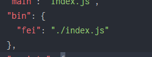
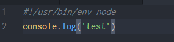
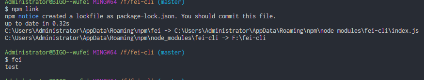
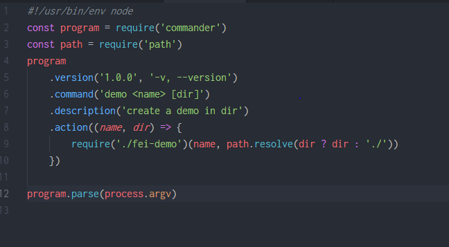

### features

##### 命令行工具

1. npm link 将本地的开发包软链接到全局包

2. package.json 中的添加bin字段，bin下的字段即为需要敲的命令，在具体脚本的顶部声明是用node执行

3. 在terminal中执行以下代码，即可看到脚本中的打印效果

   ```javascript
   1. npm link
   2. fei
   ```

   

#### commander

使用commander包来处理命令行交互， 具体使用api参看https://www.npmjs.com/package/commander




